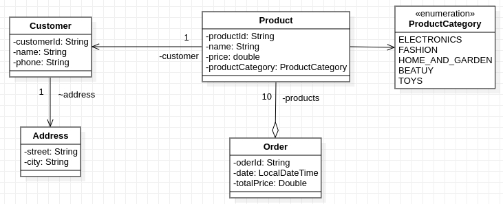

# Store App

In this I created small Java applications by using as reference an UML class diagram. Please consider following general notes before start implementing:
- toString() method when required will return a string like *ClassName{attributeName1=attributeValue1,...,attributeNamen=attributeValuen}*.
- add any constructors, getter, setters or other methods you consider are required even if are not explicitly presented in the diagrams.
- Do not reuse (import) the same class in multiple exercises. **Each exercise is standalone and should be resolved in its package.**

## Instructions:

For  bellow exercise:
1. Create Java application based on the provided UML class diagram
2. Create main method and create some objects to demonstrate the functionality 
3. Create a minimal unit test for testing the behavior of the created class.

## Exercise 1

Given the UML class diagram above, implement the corresponding Java program.

**NOTE 1** In my implementation, I used at least two of the following type definitions: enum, interface, abstract class.

**NOTE 2** No real impementaion is needed (no need to generate qr codes, integrate payment service, etc). The class diagram I create and the application will only simulate various features of the application by simply displaying messages. 
The focus will be in identifying main features of each of the components. Model each component as a class.I Identify the relation (collaboration) between classes and try to model this interactions in the application.
